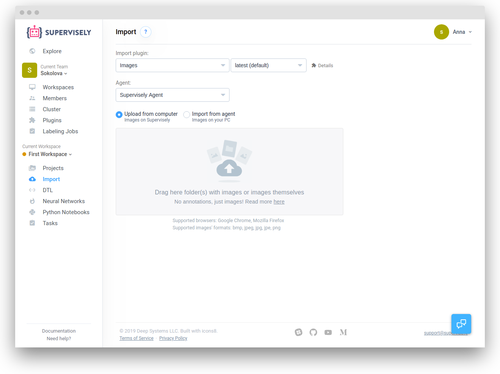
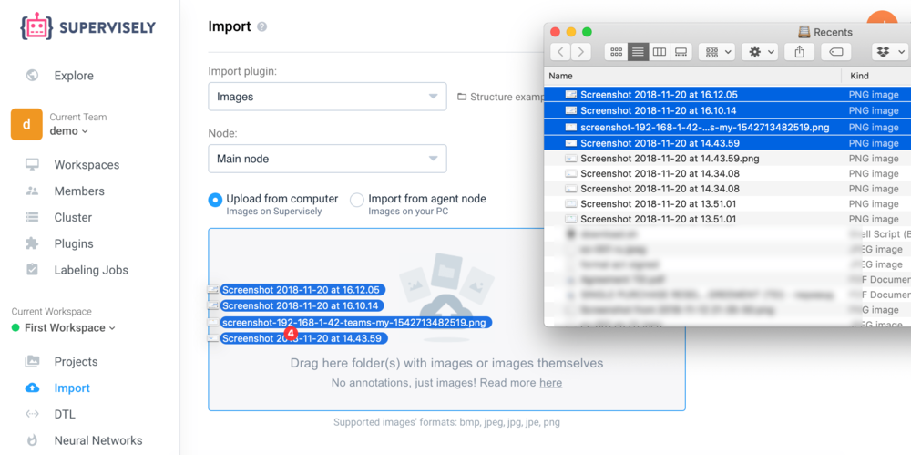

Drag and drop files and directories from your computer directly to your browser.

## Step 1: Go to the Import page

Just click "Import" in the left menu.

## Step 2: Select Plugin

Choose the format of data you are going to upload.

There are several supported types of formats.

**Most popular:**

* Images (Default) — upload directories with images 

* Supervisely Format — upload directories with images and their annotations in [Supervisely format](../../supervisely-format.md)

**Less popular:**

* Aberystwyth

* Bin masks

* Crops and weeds

* Kitti

* CityScapes - Used to upload directory with [Cityscapes dataset](https://www.cityscapes-dataset.com/)

* Mapillary - Used to upload directory with [Mapillary dataset](https://www.mapillary.com/dataset/vistas). 

* PascalVoc - USed to upload directory with [PascalVoc dataset](http://host.robots.ox.ac.uk/pascal/VOC/).

## Step 3: Drag and drop data to the special area on the page

Each format has its own requirements for the file structure:

*  [Directory with images](../formats/images.md)

*  [Supervisely format](../formats/supervisely.md)

*  [KITTI format](../formats/kitti_semseg.md)

*  [Cityscapes format](../formats/cityscapes.md)

*  [Mapillary format](../formats/mapillary.md)

*  [Pascal VOC format](../formats/pascal_voc.md)

Uploading folders is extremely useful when you are going to upload large amounts of files.


This feature is supported only with Google Chrome or Mozilla Firefox.


## Step 4: Name your Project

After you have dragged files/directories, you will be moved to the upload page. The "Import" will upload all files and directories recursively.


Do not close the browser tab during the upload process


You have to define Project name and click "Start import".

## Step 5: Wait until the task is completed

You will be moved to the "Task status" page. It also has a progress bar. A new project will be added when the import process is finished.

At this stage import adds all the necessary information to the database, checks files hashes and uploads only unique files. Also it generates small and optimized versions of each image for previews and icons.

