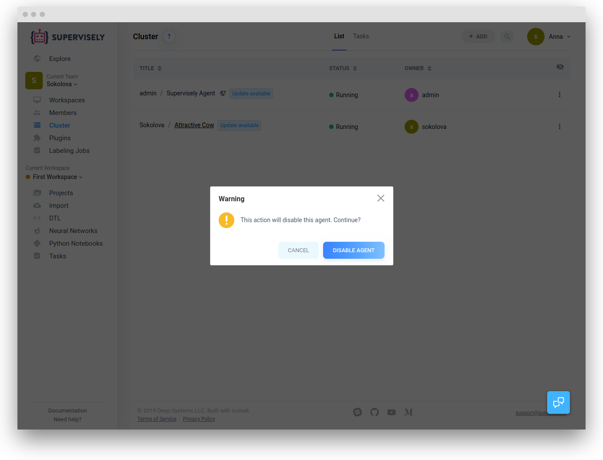

Here you can find all the necessary information about adding (or deleting) nodes to your computational Cluster. 

With the Supervisely Agent it is easy and straightforward to add new nodes to the Cluster.


We only run the tasks that you have explicitly started yourself on your agents. We will never use your nodes for benefit of others.


## System requirements

First, make sure that the computer you want to use in Supervisely meets the following requirements:

- Linux OS (Kernel 3.10)
- Docker (Version 18.0)
- GPU (CUDA 9.0) - for training and inference tasks
- Nvidia-docker - for training and inference tasks

## Installation

### Video Guide
To connect the agent you can follow the steps as they described in the following video guide:



 

### Installation Instructions

We have detailed instructions on how to connect an agent, you can see it [here](../../getting-started/connect-your-computer/README.md)

## Restarting and updating the agent

There are a few scenarios when you will need to restart an Agent: to update to the latest version or to apply your custom changes. The restart process is simple. 

Just click the "three dots" icon in the nodes list and select "Instructions". Copy the command from the instructions and run it in the terminal on the Agent's computer (host). The updated version will be automatically pulled from the Docker registry.


Restarting agent will stop all running tasks


## Disable agent

To remove the node from Supervisely simply click on the "three dots" icon in the nodes list and select "Archive". You data will stay safe and you can recover you node later by selecting the "Recover" option. 

## Stop agent(s)

If you need to stop your agent(s), you can safely do it by running the `docker stop $(docker ps -q -f "name=supervisely-agent")` command in your terminal. You can always bring it back by running `docker start $(docker ps -q -f "name=supervisely-agent")` command. The agent will re-connect to Supervisely and you will be able to continue your work.

## Remove agent(s)

To completely remove agent(s) from your machine run `docker rm -fv $(docker ps -q -f "name=supervisely-agent")` in your terminal and delete directory `~/.supervisely-agent/<token>`

