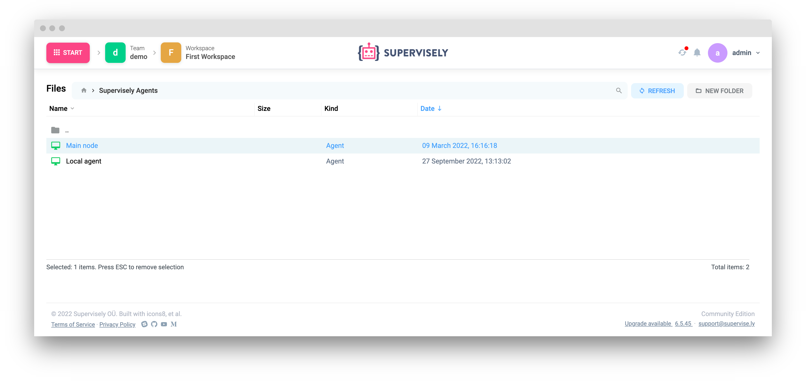
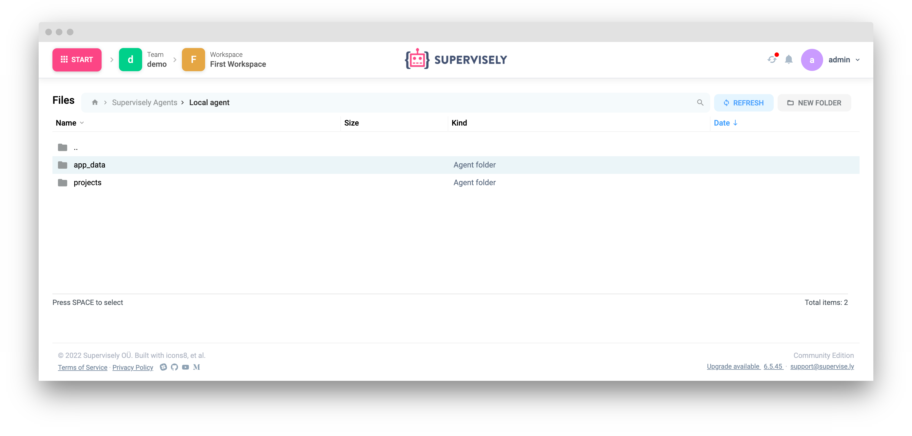
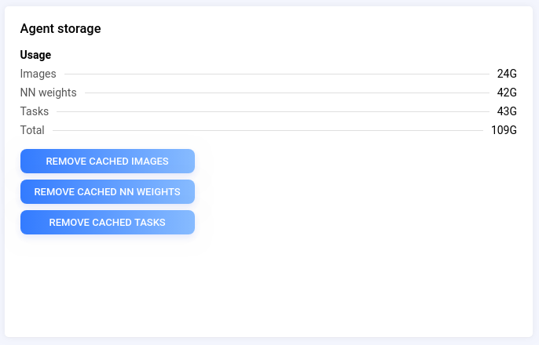

# Agent Storage & Cleanup

## Agent Storage

If you need to load a large project or want to have access to files from your host you can use "agent storage". To connect your folder to Supervisely you need to:

1. Open agents list page, click "instructions" button in agent context menu. 

- Make sure that the "Enable supervisely net" setting is enabled.
- You can change the folder using the "Folder to mount" setting. `~/supervisely/agent-{agentId}` folder will be used by default.

2. Copy generated string and run it in the terminal on your host

3. After agent connected open agent info page and check that "Agent Storage folder on Host" exists

4. Go to "Team files"

All files you place in the mounted folder will show up here.

## Agent Cleanup

User can clean cached images, stored neural networks (NN) weights and temporary task directory. Node storage shows actual information about used space.


Clean data carefully. Especially it is crutial for NN weights.



Do not clean-up cached data when agent has active tasks


### Disk usage section

In order to see used disk space go to **Cluster** section and click on your active node name. After that, wait a few seconds to receive space usage information:

### Remove cached images

When user Agent is working, caches of images is generating for data transferring minimization. This data can be cleaned safely.

- Click to **"REMOVE CACHED IMAGES"** button and wait for task finish.

### Remove cached neural networks models

When you `train`, `deploy` or `inference` neural networks - model weights automatically saves to your agent directory.


Before remove NN weights folder check that all important models were uploaded to Supervisely Server.


- For node clean-up click to **"REMOVE CACHED NN WEIGHTS"** button.

## Remove cached tasks

Every running task generate directory which can be safely cleared or removed after task is ended. The process of clearing finished task is automated, but in some cases (e.g. task crashed) task data continues to exist.


Every task directory after cleaning still contains log file


- For cached tasks clean-up **"REMOVE CACHED TASKS"** button and wait for task finish.
