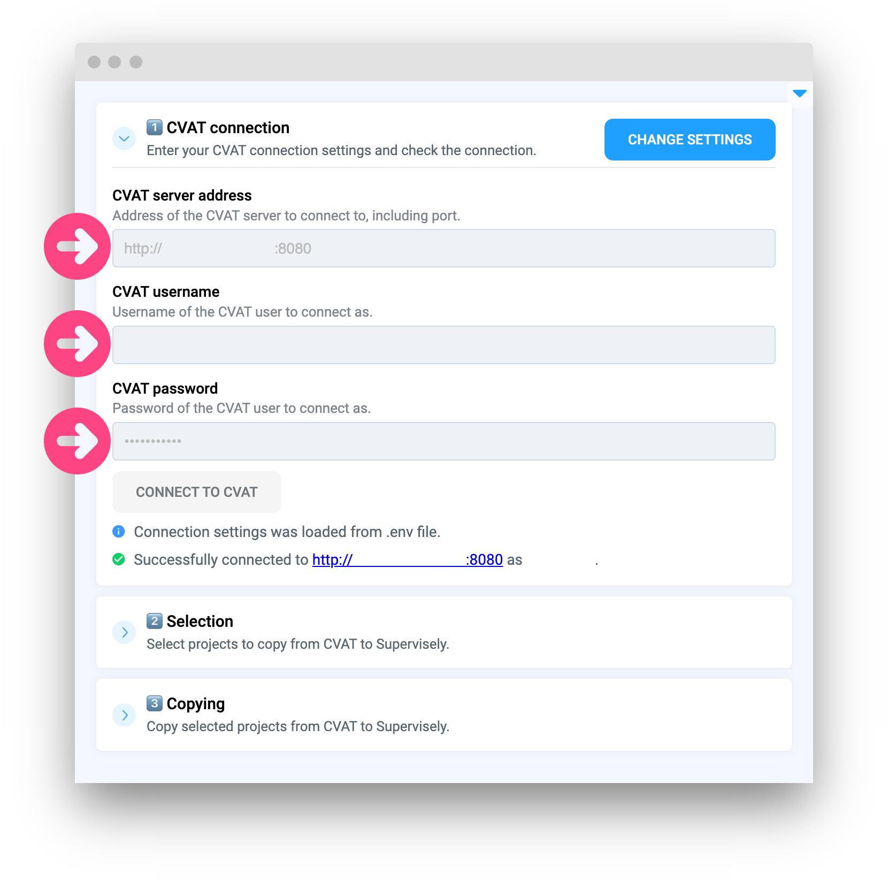

# CVAT to Supervisely Migration Tool

[This application](https://ecosystem.supervisely.com/apps/cvat-to-sly/migration_tool) allows you to copy multiple projects from CVAT instance to Supervisely instance, you can select which projects should be copied, labels and tags will be converted automatically. You can preview the results in the table, which will show URLs to corresdponding projects in CVAT and Supervisely.


If you want to upload data, which was already exported from CVAT instance, you can use this [Import CVAT](https://ecosystem.supervisely.com/apps/cvat-to-sly/import_cvat) app from Supervisely Ecosystem.



[Complete migration guide](https://ecosystem.supervisely.com/apps/cvat-to-sly/migration_tool) from CVAT to Supervisely.


## Preparation

In order to run the app, you need to obtain credentials to work with CVAT API. You will need the following information:

- CVAT server URL (e.g. `http://192.168.1.100:8080`)
- CVAT username (e.g. `admin`)
- CVAT password (e.g. `qwerty123`)
  
You can use the address from the browser and your credentials to login to CVAT (you don't need any API specific credentials).

Now you have two options to use your credentials: you can use team files to store an .env file with or you can enter the credentials directly in the app GUI. Using team files is recommended as it is more convenient and faster, but you can choose the option that is more suitable for you.

### Using team files

You can download an example of the .env file [here](https://github.com/supervisely-ecosystem/cvat-to-sly/files/12748716/cvat.env.zip) and edit it without any additional software in any text editor.

NOTE: you need to unzip the file before using it.

1. Create a .env file with the following content: `CVAT_SERVER_ADDRESS="http://192.168.1.100:8080" CVAT_USERNAME="admin" CVAT_PASSWORD="qwerty123"`.
2. Upload the .env file to the team files.
3. Right-click on the .env file, select `Run app` and choose the `CVAT to Supervisely Migration Tool` app.

The app will be launched with the credentials from the .env file and you won't need to enter it manually. If everything was done correctly, you will see the following message in the app UI:

- ℹ️ Connection settings was loaded from .env file.
- ✅ Successfully connected to `http:/192.168.1.100:8080` as `admin`.

If everything was done correctly, you will see the following message in the app UI:

- ✅ Successfully connected to `http://192.168.1.100:8080` as `admin`.

NOTE: The app will not save your credentials, you will need to enter them every time you launch the app. To save your time you can use the team files to store your credentials.