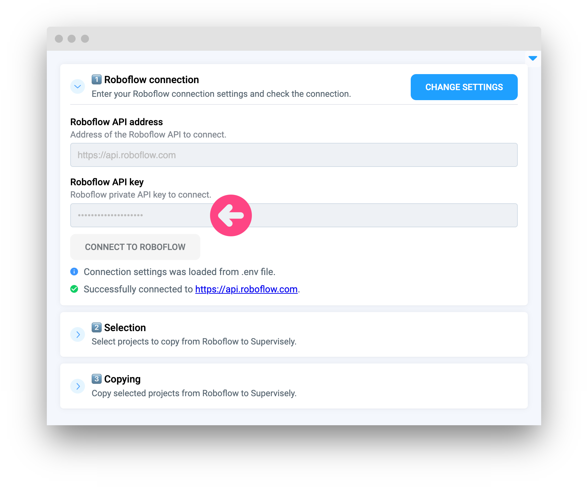

# Roboflow to Supervisely Migration Tool


[Complete migration guide](https://ecosystem.supervisely.com/apps/roboflow-to-sly) from Roboflow to Supervisely.


This application allows you to copy multiple projects from Roboflow instance to Supervisely instance, you can select which projects should be copied, labels and tags will be converted automatically. You can preview the results in the table, which will show URLs to corresponding projects in Roboflow and Supervisely.

## Preparation

ℹ️ NOTE: Every project in Roboflow MUST contain at least one version, otherwise it's impossible to export data from Roboflow. Learn more about Versions in [Roboflow documentation.](https://docs.roboflow.com/datasets/create-a-dataset-version)

In order to run the app, you need to obtain `Private API key` to work with Roboflow API. You can refer to [this documentation](https://docs.roboflow.com/api-reference/authentication) to do it.

Now you have two options to use your API key: you can use team files to store an .env file with or you can enter the API key directly in the app GUI. Using team files is recommended as it is more convenient and faster, but you can choose the option that is more suitable for you.

### Using team files

You can download an example of the .env file [here](https://github.com/supervisely-ecosystem/roboflow-to-sly/files/13214150/roboflow.env.zip) and edit it without any additional software in any text editor.
NOTE: you need to unzip the file before using it.

1. Create a .env file with the following content: `ROBOFLOW_API_KEY="qASymt32UTnQV1qABszF"`
2. Upload the .env file to the team files.
3. Right-click on the .env file, select Run app and choose the Roboflow to Supervisely Migration Tool app.

The app will be launched with the API key from the .env file and you won't need to enter it manually. If everything was done correctly, you will see the following message in the app UI:

- ℹ️ Connection settings was loaded from .env file.
- ✅ Successfully connected to https://api.roboflow.com.

### Entering credentials manually
1. Launch the app from the Ecosystem.
2. Enter the API key.
3. Press the Connect to Roboflow button.

If everything was done correctly, you will see the following message in the app UI:

- ✅ Successfully connected to https://api.roboflow.com.


NOTE: The app will not save your API key, you will need to enter it every time you launch the app. To save your time you can use the team files to store your credentials.



[Complete migration guide](https://ecosystem.supervisely.com/apps/roboflow-to-sly) from Roboflow to Supervisely.
