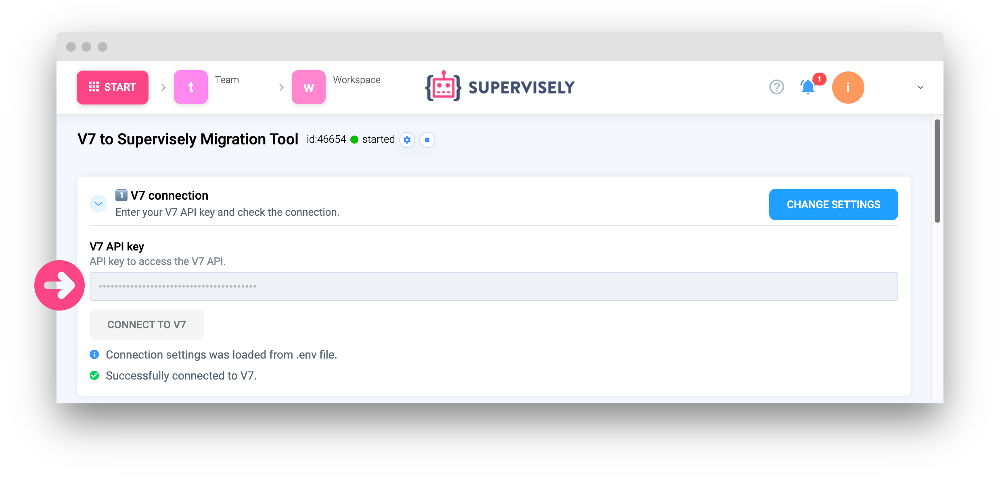

# V7 to Supervisely Migration Tool

[This application](https://ecosystem.supervisely.com/apps/v7-to-supervisely/migration_tool) allows you to copy multiple datasets from V7 instance to Supervisely instance, you can select which projects should be copied, labels and tags will be converted automatically. You can preview the results in the table, which will show URLs to corresdponding projects in V7 and Supervisely. Every V7 dataset will be converted in a separate Supervisely project.


If you want to upload data, which was already exported from V7 instance, you can use this [Import V7](https://ecosystem.supervisely.com/apps/v7-to-supervisely/import_v7) app from Supervisely Ecosystem.



[Complete migration guide](https://ecosystem.supervisely.com/apps/v7-to-supervisely/migration_tool) from V7 to Supervisely.


## Preparation

In order to run the app, you need to obtain API key to work with V7 API. You can refer to [this documentation](https://docs.v7labs.com/reference/introduction#generating-an-api-key) to do it.

Now you have two options to use your API key: you can use team files to store an .env file with or you can enter the API key directly in the app GUI. Using team files is recommended as it is more convenient and faster, but you can choose the option that is more suitable for you.

### Using team files

You can download an example of the .env file [here](https://github.com/supervisely-ecosystem/v7-to-supervisely/files/13297606/v7.env.zip) and edit it without any additional software in any text editor.

NOTE: you need to unzip the file before using it.

1. Create a .env file with the following content: V7_API_KEY="JUFxKUH.wfjargM-xZ3-K2wR2kkZaxFM-AqTiZWs"
2. Upload the .env file to the team files.
3. Right-click on the .env file, select Run app and choose the V7 to Supervisely Migration Tool app.

The app will be launched with the API key from the .env file and you won't need to enter it manually. If everything was done correctly, you will see the following message in the app UI:

- ℹ️ Connection settings was loaded from .env file.
- ✅ Successfully connected to V7.
  
### Entering credentials manually

1. Launch the app from the Ecosystem.
2. Enter the V7 api key.
3. Press the Connect to V7 button.

