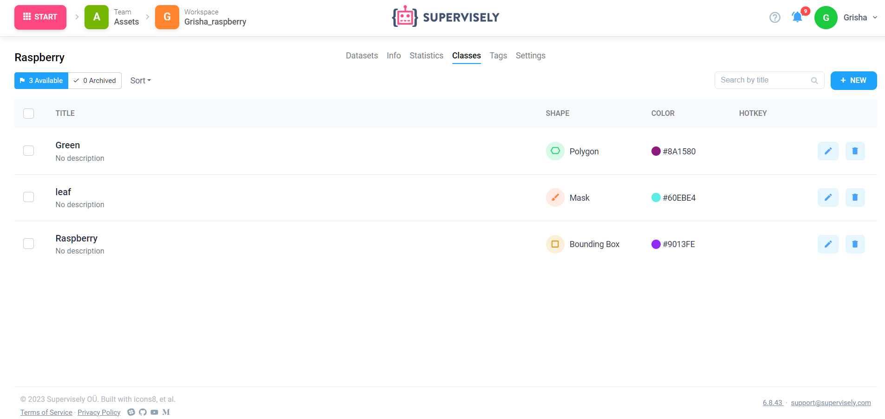
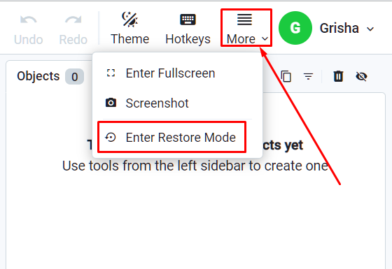

# Classes

Classes are pre-defined types of your annotations (i.e. "Background" or "Tumor"). Thus, every labeled object on image or video frame has exactly one class associated.

Usually, you define classes before labeling starts, but you can add new classes in the labelling interface on-fly (if you have enough permissions, of course).

If you delete the class, then the objects drawn by this class are disabled, and they can later be restored using the restore mod function

## Shape

You can limit tools that can be used to create an instance of a class by setting a class **Shape**. For example, if you select a raster shape, the annotator might use Brush or Smart Tool for the object, but not Polygon. This can be very helpful in big projects and guarantee that your data scientists won't need to convert Cuboids to Polygons two months after labeling is finished.

If you don't want to constrain the shape, set it to **Any Shape** - this way you can create "Cars" from both polygons and bitmaps.

## Hotkey

Optionally, you can assign a Hotkey for a class to quickly select it during labeling. You can only set a single latin character (because other combinations may be unavailable).

