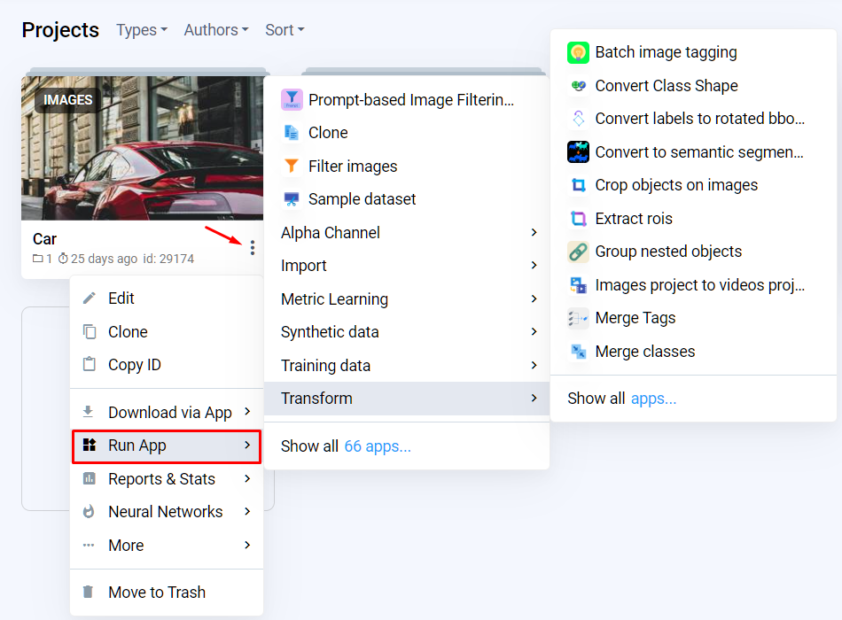

# Projects

You can think of a Project as a superfolder with data and metadata, like classes and tags. Every dataset inside the project will share the same metadata and have the same classes and tags defined on the project-level.

## Projects List

At the "Projects" page you can view all projects you have in the current [workspace](/collaboration/teams.md).

Please note the ⋮ ("three dots") icon in the bottom right corner of a project. From here (we call it a "content menu") you can perform many important activities related to the project: for example: like clone, run app for project or delete a project.  

## How to create a Project

Wait, there is no "Create" button on this page. So how do I create one?

You can take a [sample project](https://ecosystem.supervisely.com/import+images+project) from the ecosystem.

### Import Data

[Upload](../import/import/import.md) images, videos or other files from your computer at the ["Import"](../import/import/import.md) page. You will be asked to provide a name for a Project — and after successful import, you will have one.

### Add using API

If you want to automate the process of adding new data, it's a way to go! We have a powerful [API](https://api.docs.supervisely.com) and [SDK](https://supervisely.readthedocs.io/en/latest/sdk_packages.html) that lets you start in no time. 

## Project Type

At the moment we support:

- Images
- Videos
- 3D Point Clouds
- DICOM

You can see a project type in the top left corner of a project card.

## Cards & table views
At the Project page you can change how to list projects and datasets: as cards or as a table. You can switch the view by clicking the icon at the most right side of the page.

## Filter & sort projects
Show only specific projects and datasets by multiple parameters, including project type, labeling job, author and so on.

## Data Commander
You can also find the list of your projects across all of your teams and workspaces by navigating to the [Data Commander](../data-commander/README.md). There, you can move or copy both projects, datasets, images and even project metadata.

## Trash Bin
You can remove one or multiple projects and datasets by selecting them using checkboxes and clicking the “Move to Trash” button. This won’t delete your data immediately — you can learn more in the [Storage Cleanup](../storage/README.md) section.

