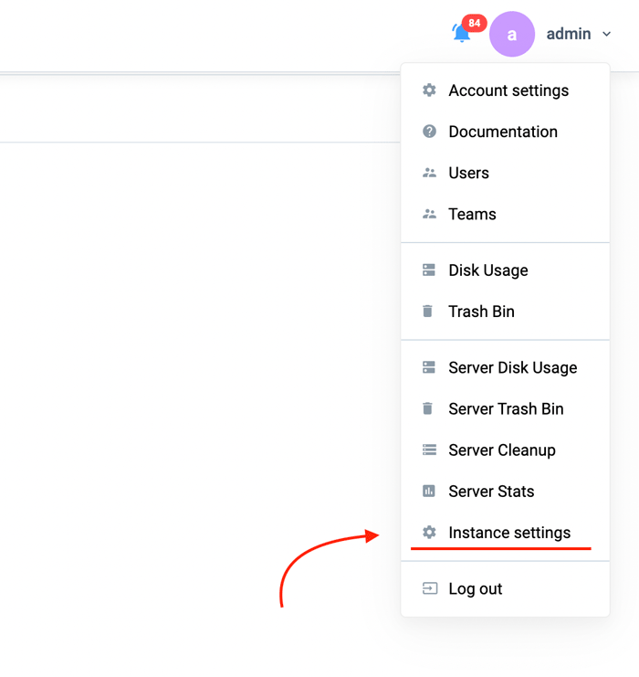
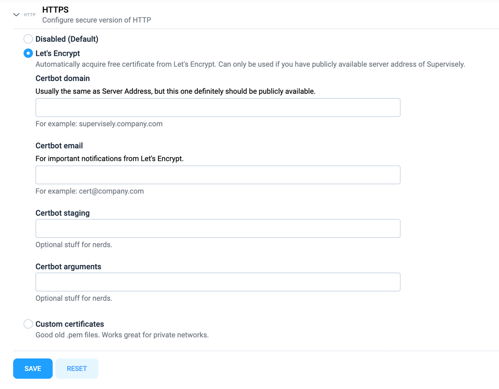
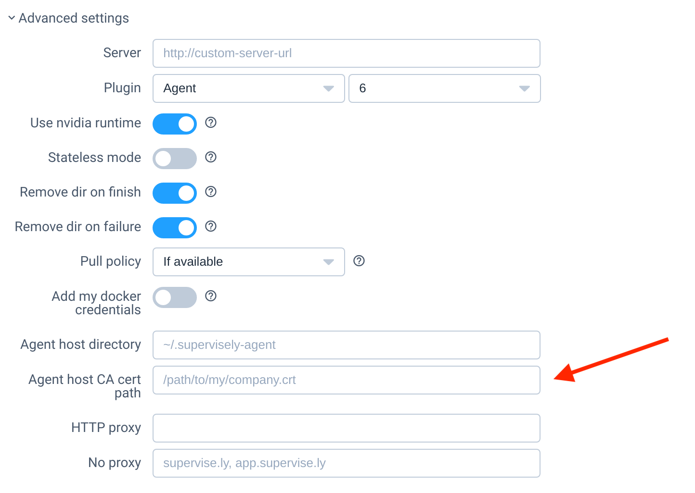

By default Supervisely starts on port 80 without HTTPS. While it's fine for internal usage, sometimes you need to provide access to Supervisely over internet. In that case using HTTPS is highly recommended. 

This guide will help you to run Supervisely over HTTPS.

## UI configuration

Usually, enabling HTTPS can be done in just a few clicks. Please login as the "admin" user and open "Instance Settings" page under your account menu:



Now, open "HTTPS" section and switch "Let's encrypt" option on. Enter the address you access the instance now, without "http://" (i.e. `supervisely.my-company.com`) and your email. Click "Save" — your Supervisely instance will apply the new configuration and restart itself: you should be able to access Supervisely now via `https://supervisely.my-company.com`.



## Manual configuration

If, for some reason, the default method via UI does not work for you, there are a few options how to enable HTTPS directly via configuration files.

### Option 1. Using Let's Encrypt

Create a new file `docker-compose.override.yml` in the folder with `docker-compose.yml` (you can find it by running `supervisely where` command) configuration with the following content:

```
version: '2.2'
services:
  proxy:
    environment:
      CERTBOT_DOMAIN: <domain>
      CERTBOT_EMAIL: <email>
      CERTBOT_STAGING: <use this first for testing>
      CERTBOT_ARGS: <additional certbot arguments>
    ports:
      - 443:443/tcp
    volumes:
      - /supervisely/data/letsencrypt_cache:/etc/letsencrypt:rw
      - /supervisely/data/certs:/etc/nginx/certs:rw
```

For example:

```
version: '2.2'
services:
  proxy:
    environment:
      CERTBOT_DOMAIN: supervisely.company.com
      CERTBOT_EMAIL: cert@company.com
    ports:
      - 443:443/tcp
    volumes:
      - /supervisely/data/letsencrypt_cache:/etc/letsencrypt:rw
      - /supervisely/data/certs:/etc/nginx/certs:rw
```

Run `supervisely up -d` to apply changes. It will take a few minutes to issue your new certificates. After `default.crt` fill appear in the `data/certs` folder, run `supervisely restart proxy` — now your Supervisely instance works over HTTPS! Please do not forget to change `SERVER_ADDRESS` in your `.env` file accordingly.

### Option 2. Built-in SSL support

As an entrypoint we share `proxy` docker service based on nginx on host port 80. To enable https support you simply need to share certs as a volume from host.

Create a new file `docker-compose.override.yml` in the folder with `docker-compose.yml` configuration with the following content:

```
version: '2.2'
services:
  proxy:
    ports:
      - 443:443/tcp
    volumes:
      - /etc/letsencrypt/live/yourdomain/fullchain.pem:/etc/nginx/certs/default.crt
      - /etc/letsencrypt/live/yourdomain/privkey.pem:/etc/nginx/certs/default.key
```

Where `/etc/letsencrypt/live/yourdomain` is a path to your SSL certs (in example above we use [letsencrypt](https://letsencrypt.org/) default location).

Now update `proxy` by running `docker-compose up -d proxy` command. It will detect your certs and automatically switch to HTTPS mode. 


We create `docker-compose.override.yml` instead of modifying so that your changes will persists after upgrade.



If you try to access Supervisely over HTTP, you will be automatically redirected to the HTTPS version



### Option 3. Setup reverse-proxy

If, for some reason, you built-in Supervisely proxy doesn't meet your needs, you can run a reverse-proxy server in front of Supervisely. For example, you can use [docker-ssl-proxy](https://hub.docker.com/r/fsouza/docker-ssl-proxy/) to achieve that.

Because we use long-polling to communicate with agents you also need the request timeouts to be set higher. For example, for nginx we suggest the following additional lines:

```
proxy_http_version 1.1;
proxy_buffering off;
proxy_request_buffering off;

client_max_body_size 0;
proxy_send_timeout 3600;
proxy_read_timeout 3600;
send_timeout 3600;
```


### Configuring Agents

If you are using a custom self-signed certificate, you will need to provide it to your agents so that they can connect to the instance. To do it, go to the Cluster page, select "Instructions" in each agent context menu and under "Advanced" provide path to your CA certificate:



Run generated command on your machine to re-deploy this agent and to apply the changes.


If you have multiple CAs you need to concat all of them into one file and use that file so it trusts the whole chain, i.e. `cat globalroot.crt secondary.crt > ca_chain.crt`

