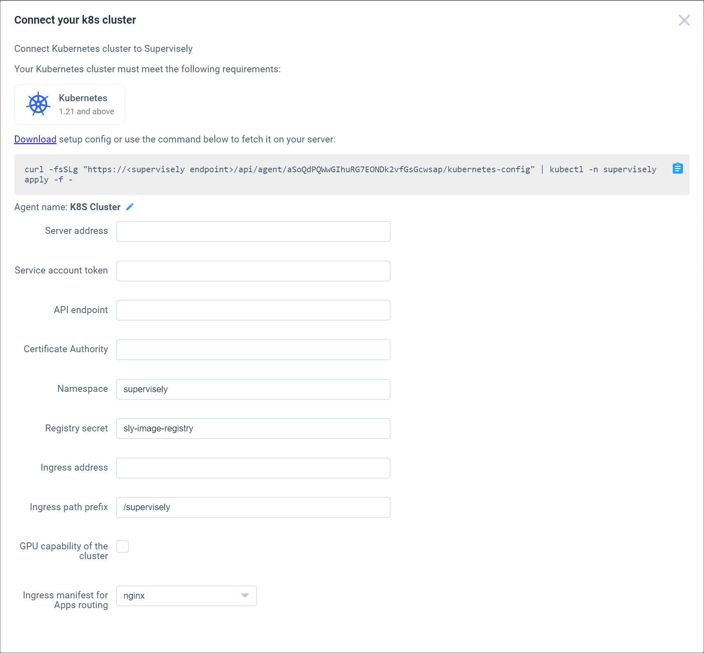

Follow these steps to connect Kubernetes cluster with Supervisely to run Apps on it.


**BETA** Keep in mind that this is a beta version and some features may not work as expected.


## Add a Kubernetes cluster

Go to the `Team Cluster` page, click `Add` button and select `Kubernetes` in the popup window.

You will see the following window:

## Configure the options

`Server address` - this is the address of your Supervisely server that is accessible from Kubernetes cluster.

`Service account token` - long-term token that will be used to authenticate Kubernetes cluster with Supervisely. You can find the token value using `kubectl -n supervisely get secret sly-task-manager-token -o jsonpath='{.data.token}'`

`API endpoint` - this is the address of your Kubernetes cluster API server that is accessible from Supervisely server.

`Certificate Authority` - this is the CA.crt certificate that is used to verify the identity of the Kubernetes cluster API server. You can find the CA value using `kubectl -n supervisely get secret sly-task-manager-token -o jsonpath='{.data.ca\.crt}'`

`Namespace` - a namespace in which all the resources required to deploy Supervisely Apps will be created.

`Registry secret` - a secret from the `namespace` above that will be used to pull container images from the registry. This is included in the configuration file that you will receive from Supervisely.

`Ingress address` - this is the address used to proxy requests to the Supervisely Apps, essentially this is the address used to access your Ingress.

`Ingress path prefix` - this is the path prefix used for the Ingress rules to avoid conflicts with other services running on the same Kubernetes cluster.

`GPU capability of the cluster` - this setting notifies Supervisely that it can use this cluster for GPU deployments. Make sure that you have installed [NVIDIA Device plugin](https://github.com/NVIDIA/k8s-device-plugin) on your cluster first and confirm the installation by checking nvidia node labels via `kubectl get nodes --show-labels`.

`Ingress manifest for Apps routing` - this is the manifest that will be used to route traffic to the Supervisely Apps. You can use the default NGINX manifest or provide your own.
This is a work in progress and we will be adding more manifests in the future.