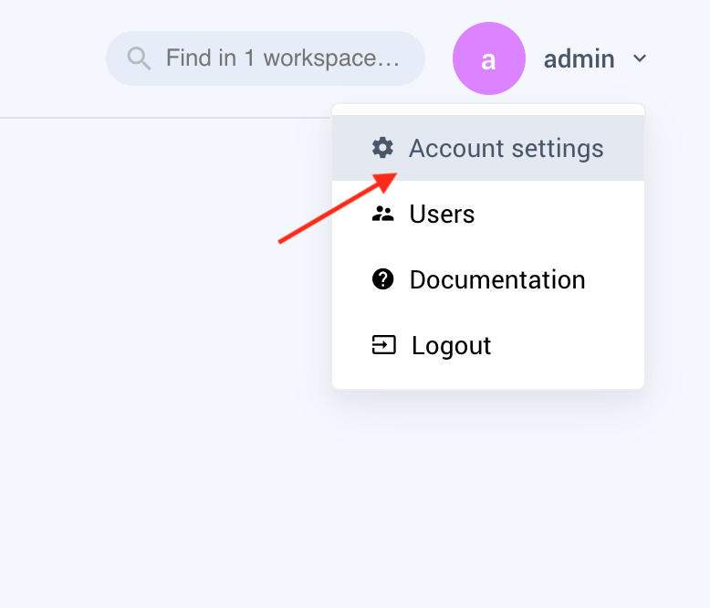

## Change the default password

We strongly recommend you to change the default password. To do it, please click on thr user in the top right corner, click "Account settings" and navigate to "Change password".

  

## Create new users

By default we create two users: "admin" (to administrate the instance) and "supervisely" (to share demo projects and models in Explore).

We strongly advice you to keep admin account clean from models and projects and create separate teams and users for security reasons - if you would perform all the work in admin's team you may accidentally end up with overpopulated team with full access to everything. 

Click on the user in the top right corner and select "Users". Here you can manage existing users, delete them, login under their accounts and create new ones.

Click "Signup" to create a new user. We will automatically create a new team for that user and populate "Plugins" section with default plugins, marked as "Seed" (i.e. "Import / Images" or "DTL"). 

## Configure your instance

A good idea would be to check the Instance Settings page located in the admin's user menu. You will find tons of options you might like to configure, for example, enable HTTPS support or disable signup page:

## Deploy an additional agent (optional)

Every kind of potentially long operation (like Import or Training) is performed on so-called [agents](../../customization/agents/README.md). Before you can use Supervisely, you should deploy at least one.

During the installation we automatically deploy a default "Main Node" agent via `supervisely deploy-agent` so you don't have to do anything. But, if you don't have a GPU device on your machine with Supervisely, you may want to deploy an additional agent on AWS or some computer with a videocard.

Go to Cluster page and click "Add agent". Execute command from popup window on your server in terminal (you can use the same machine where Supervisely is deployed).

The status of deployed agent should change from "Waiting" to "Running". Now you can start using all features of Supervisely!


Choose "Share with all users" from agent context menu if you want any user of your instance to perform tasks on it. 



If you see at Cluster page that your Main Node is in Waiting status, it means that it could not be connected to Supervisely. Please check `SERVER_ADDRESS` variable in your `.env` file. Agent should be able to make outbound connections to that IP or Host. As a quick solution you can find your `docker0` ip address that act as `locahost` for Docker: run `ip addr list docker0` and use it in `SERVER_ADDRESS`. It should look like `172.17.0.1` or something. Run `supervisely deploy-agent` to apply your changes. Main Node at Cluster page should change status to "Running" 


## Import your own dataset

Go to the Import page, make sure preset "Supervisely / Images" is selected and drag-and-drop a folder with some images. Enter a name for the new project, wait till the files are uploaded and click "Import". New import task has been started and you will see your new project on the Projects page after it's finished.


If you see message like above at Import page, there could be two reasons: 1). You are logged-in as "admin" user. We do not automatically add any plugins to admin team. You can do it manually from Explore section, but we suggest to create new user instead. 2). Another reason is that you don't have active agents at Cluster page. Check "Main Node is in Waiting status" section above. 

