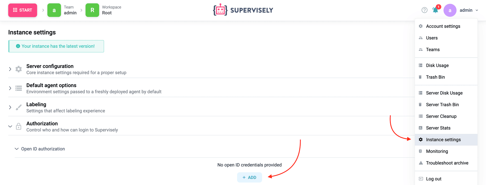
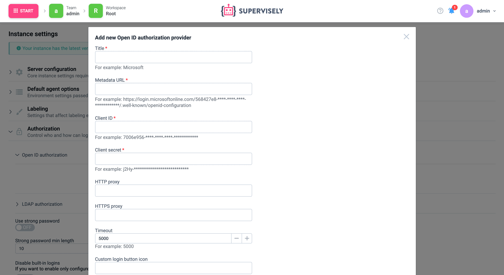
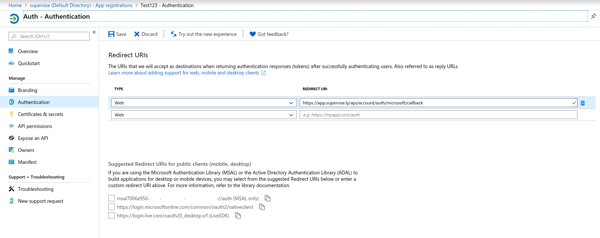
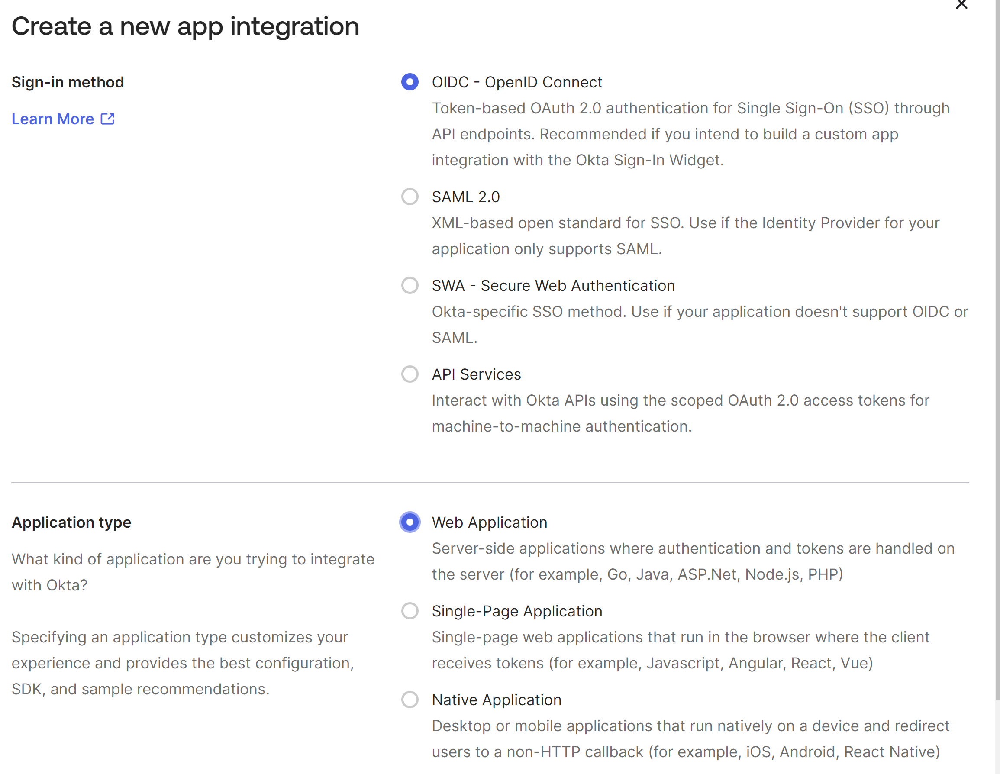
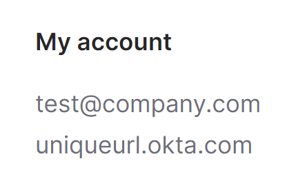
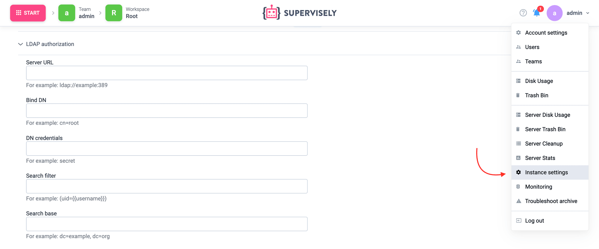

In Supervisely multiple users can create accounts, login using passwords and collaborate together in teams.

Supervisely Enterprise Edition supports more advanced use cases, such as Single Sign-On (SSO) from one of many providers including OpenID or LDAP, or special authentication requirements.


Superadmin user (the one with login "admin") always uses internal authorization scheme with password to allow platform configuration even with incorrect SSO settings.


## OpenID (OIDC, Azure, etc...)

The simplest way to configure Open ID authorization is to use the Instance Settings page.

Login as "admin" user and select "Instance Settings" under the user menu in the top right corner of your screen. Scroll down to the Authorization section and select Open ID authorization.



Click the "Add" button and provide credentials to your Open ID authorization provider.

You may also consider switching "Disable built-in logins" and "Allow only existing users" (see below).



Do not forget to click the "Save" button at the bottom to apply your changes.

<details>

<summary>Manual configuration using docker-compose.override.yml</summary>

If you have troubles with using the Instance Settings page, you can configure Open ID authorization manually.

1\. Open terminal and go to the Supervisely configs folder

```sh
$ cd $(sudo supervisely where)
```

2\. Create `openid.yml` file with external service credentials

```yaml
<provider_name>:
  metadata_url: <metada_url>
  client_id: <client_id>
  client_secret: <client_secret>

  # optional
  http_proxy: <proxy url>
  https_proxy: <proxy url>
  icon: <url> / <base64> / <svg> (login button icon)
  login_label: <login_label> (login button label)
  extra_scope: <array> (list of additional scopes) # deprecated, use extra_settings.scope
  extra_settings: # <optional object if specific settings are required>
    scope: <array> (list of additional scopes)
    token_endpoint_auth_method: <string>
    acr_values: <string>
```

3\. Create `docker-compose.override.yml` file

```yaml
version: '2.4'

services:
  api:
    environment:
      DOMAIN: <https_instance_domain>
    volumes:
    - <path_to_folder>/openid.yml:/openid.yml:ro
```

>Notice: if you update the `openid.yml` file later then you need to execute `sudo supervisely restart api` instead of `up -d`

4\. Execute following command

```sh
$ sudo supervisely up -d
```

5\. Go to your authorization service and add new redirect (callback) URI `<https_instance_domain>/api/account/auth/<provider_name>/callback`
where:
  - https_instance_domain - domain, that you specified in `docker-compose.override.yml`
  - provider_name - name, that you specified in `openid.yml`

</details>


## Microsoft Azure Active Directory

Microsoft Azure Active Directory uses OpenID protocol, so it is basically the same as above, with a few extra steps.

First you need to [register app](https://docs.microsoft.com/en-us/azure/active-directory/develop/quickstart-register-app) and [configure web API access](https://docs.microsoft.com/en-us/azure/active-directory/develop/quickstart-configure-app-access-web-apis).

On [Add redirect URI(s) step](https://docs.microsoft.com/en-us/azure/active-directory/develop/quickstart-configure-app-access-web-apis#add-redirect-uris-to-your-application) add new URI `<https_instance_domain>/api/account/auth/microsoft/callback`



Now, you can add a new OpenID provider as described above. Your credentials may look something like this:

```yaml
Metadata Url: https://login.microsoftonline.com/568427e8-****-****-****-************/.well-known/openid-configuration
Client ID: 7006e956-****-****-****-************
Client Secret: j2Hy-***************************
```

## OKTA

OKTA uses OpenID protocol, so it is basically the same as above, with a few extra steps.

First, you need to register a new app.

Click Applications → "Create App Integration" button and then select "OIDC - OpenID Connect" and "Web Application".



Make sure that "Authorization Code" code is selected. Under `Sign-in redirect URIs` add a new URI `<https_instance_domain>/api/account/auth/okta/callback`.

You can find `metadata_url` by clicking on your account name in the top right corner.



Copy and save your client ID and client Secret. You can now proceed with modifications on the server-side.

Your Metadata URL should look like this: `https://<subdomain from okta>.okta.com`.


## LDAP

The simplest way to configure LDAP authorization is to use the Instance Settings page.

Login as "admin" user and select "Instance Settings" under the user menu in the top right corner of your screen. Scroll down to the Authorization section and select LDAP authorization.



Provide your credentials there. You may also consider switching "Disable built-in logins" and "Allow only existing users" (see below).

Do not forget to click the "Save" button at the bottom to apply your changes.

<details>

<summary>Manual configuration using docker-compose.override.yml</summary>

If you have troubles with using the Instance Settings page, you can configure LDAP authorization manually.

1\. Open terminal and go to the Supervisely configs folder

```sh
$ cd $(sudo supervisely where)
```

2\. Create `docker-compose.override.yml` file

```yaml
version: '2.4'

services:
  api:
    environment:
      LDAP_SERVER_URL: <server_url>
      LDAP_BIND_DN: <bind_dn>
      LDAP_DN_CREDENTIALS: <password_for_bind_dn>
      LDAP_SEARCH_FILTER: <search_filter>
      LDAP_SEARCH_BASE: <search_base>
```

3\. Execute the following command

```sh
$ sudo supervisely up -d
```

###### docker-compose.override.yml example

```yaml
version: '2.4'

services:
  api:
    environment:
      LDAP_SERVER_URL: ldap://example:389
      LDAP_BIND_DN: cn=root
      LDAP_DN_CREDENTIALS: secret
      LDAP_SEARCH_FILTER: (uid={{username}})
      LDAP_SEARCH_BASE: dc=example, dc=org
```

</details>

## Authorization settings

Beside SSO providers, such as OpenID and LDAP, you can configure more settings to control settings for both internal and external authorizations. Those settings include session lifetime, password requirements and more.

To find the settings, login as "admin" user and select "Instance Settings" under the user menu in the top right corner of your screen. Scroll down to the Authorization section. Some of the noticeable options:

### Disable built-in logins

By default we allow to login both users created in Supervisely and outside of Supervisely in connected SSO. This could cause confusion with matching logins or violate security policies. You can enable this option and allow only external users validated via SSO.

### Only allow existing users

By default, when you sign into the platform using SSO and we detect that this login has not yet been used in Supervisely platform, we automatically create a new account on the platform with that login.

You can disable this behavior using this option. This could be useful if you have lots of accounts in your SSO and you only want specific users to be allowed to login into Supervisely. In that case, you can use the "Users" page to manually provide logins that would be able to login into Supervisely via your SSO.
