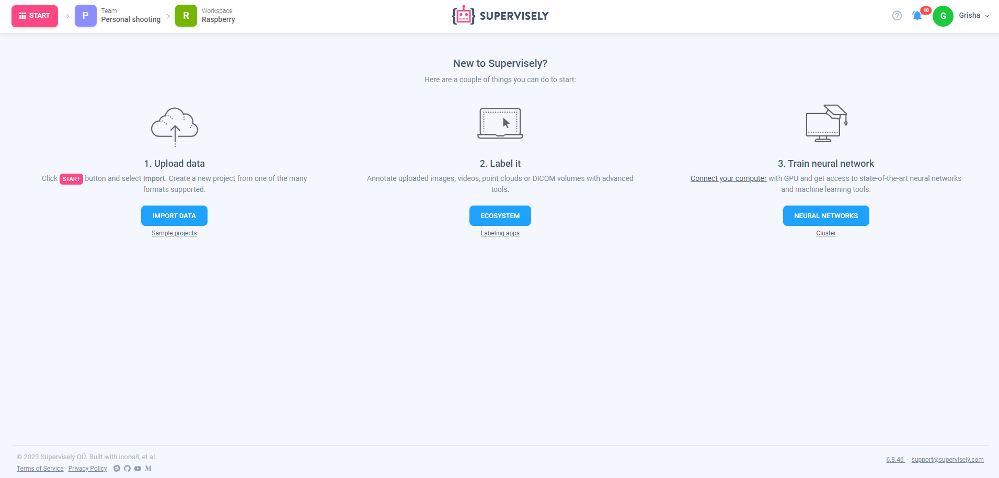
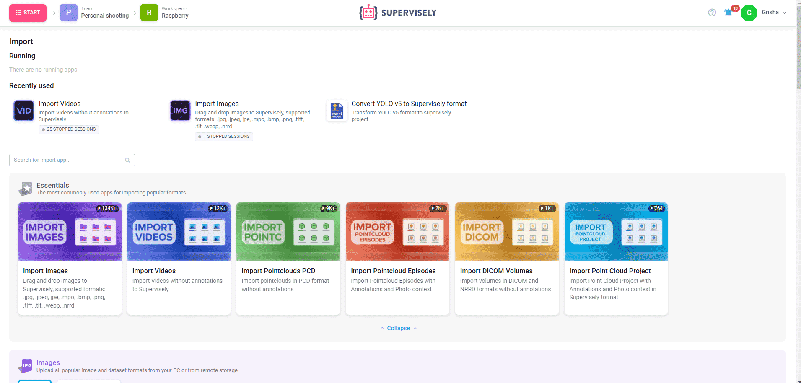
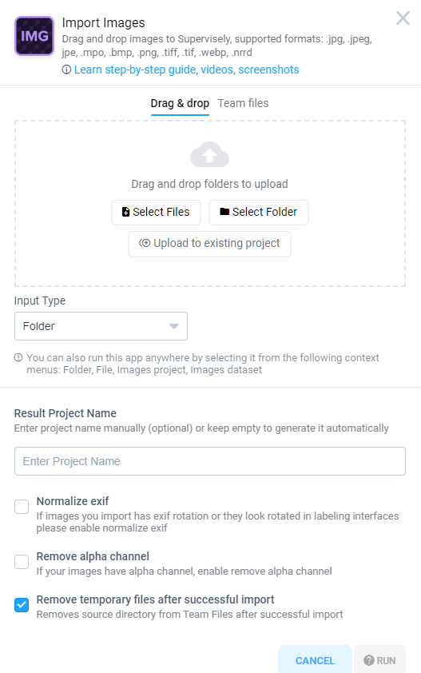
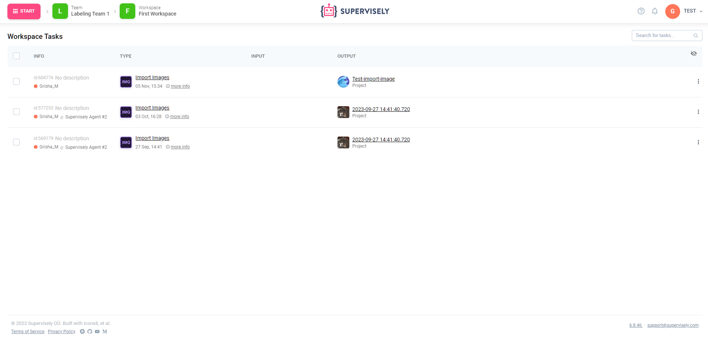
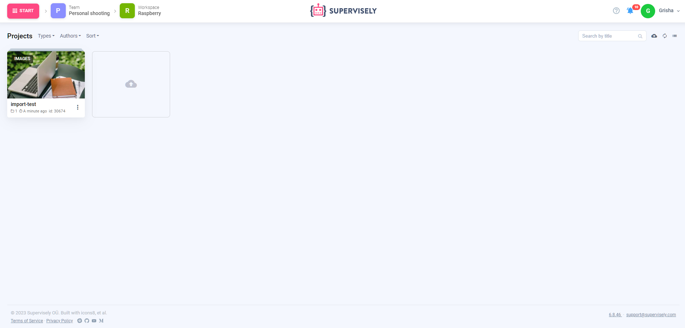

# How to import


This 5-minute tutorial is a part of introduction to Supervisely series. You can complete them one-by-one, separately, or jump the rest of the documentation at any moment.

- How to import **(you are here)**
- [How to annotate](How-to-annotate.md)
- [How to invite team members](Invite-member.md)
- [How to connect agents](connect-your-computer/README.md)




You can learn more about Import, such as importing different formats, import from the cloud or adding data to existing datasets in [this section.](../data-organization/import/import/import.md)



Let's start our journey with Supervisely by uploading our very first image. Of course, you can import more complex dataset formats like COCO, or modalities, such as DICOM, connect a S3 cloud and much more, but let’s begin with a simple one.

We assume that you have already created an account in Supervisely. If not, you can create a free account in our Community Edition [here.](https://app.supervisely.com/signup)

First thing you will see after you login to Supervisely, is your [Projects](../data-organization/project/projects.md) page where you can find your data. But there is nothing here yet — let’s fix that!

Click the Start button at the very top left corner of the page and click Import. You will see a selection of [Supervisely Apps](https://ecosystem.supervisely.com/import/apps) that allows you to import data to Supervisely.

Hover your cursor over the card “Import Images“ in the Essentials section and click Run App. This is how you run Supervisely Apps — and there are many more of them! Some will let you label your data, train neural networks or perform data operations. And most of them are open-source!

Anyway, here, in the modal window, drag and drop one or more images in one of the supported formats, such as .jpg, .png, .bmp and so on (you can find supported formats and other information about any application by clicking at the “Learn step-by-step guide, videos, screenshots” link). You will see uploading progress (your files are actually being uploaded to your [Team Files](../data-organization/team-files/README.md)).

Once the uploading is finished, enter a name in the “Result Project Name” field and click the “Run” button at the bottom of the modal window (you might need to scroll down a bit).

You will be redirected to the tasks page where you can watch the progress of the application. You can click “three dots” (⋮) icon and check the application logs.


🤓 **Nerd alert! You can skip this section if you are not interested how Supervisely works inside.**

So what is going on here? First, Supervisely will choose one of the connected Agents and ask it to run the “Import Images'' application. It will spawn a Docker container that will download the GitHub repository with the application code and run python code written with Supervisely SDK. It will pull your images, uploaded to the Team Files in the modal window, convert them, if needed (this particular application maybe does little, but others, like Import COCO format, will transform a lot) and use API to create a Project and add images to it.


Once the import is finished, you will see the link to your new project in the Output column of the table.

All set! Now, in the [next section](How-to-annotate.md), let’s annotate your uploaded images.

