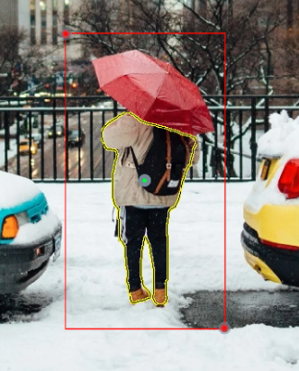
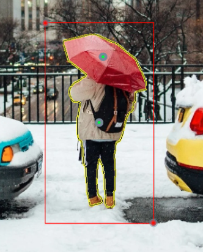
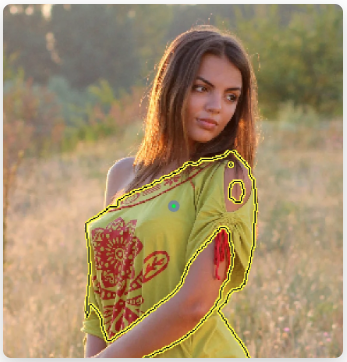
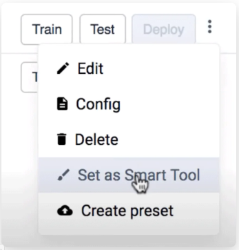
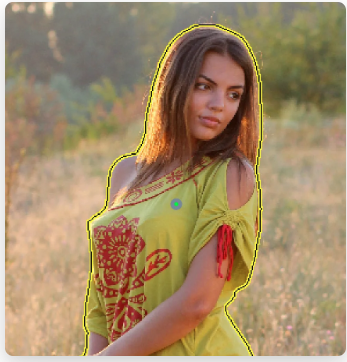

# Interactive AI-Assistance



Please check the those awesome tutorials and guides:

- [Automate manual labeling with custom interactive segmentation model for agricultural images](https://supervisely.com/blog/custom-smarttool-wheat/)
- [Segment Anything in High Quality (HQ-SAM): a new Foundation Model for Image Segmentation (Tutorial)](https://supervisely.com/blog/segment-anything-in-high-quality-HQ-SAM/)
- [How to Train Smart Tool for Precise Cracks Segmentation in Industrial Inspection](https://supervisely.com/blog/industrial-inspection-cracks-segmentation/)
- [Complete Guide to Object Tracking: Best AI Models, Tools and Methods in 2023](https://supervisely.com/blog/complete-guide-to-object-tracking-best-ai-models-tools-and-methods-in-2023/)
  


## SMART TOOL

Manual segmentation of a complex shape can be ridiculously time-consuming. Our tool uses AI to produce high quality results with lower cost.

|        1            | 2                    |        3     |
|:-------------------:|:-------------------:|:--------------:|
|  |    | |
| **Select region of interest**. It does not matter if your object was never seen by our neural network - it’s class-agnostic | **Refine model predictions**. If needed, correct output by pointing where is background and where is an object|**Get pixel-wise segmentation**. Your annotation is saved as a bitmap along with guiding input  |

## CLASS-AGNOSTIC

Smart tool is class-agnostic — it was not trained to capture specific objects, but rather any forms that stand out.



## TRAINABLE NEURAL NETWORK

What’s great about the neural network in the core of the smart tool is that it can be re-trained to better fit your very unique case and produce unprecedented results with just a little bit of extra data.

|        1            | 2                    |        3     |
|:-------------------:|:-------------------:|:--------------:|
||| |
|**Prediction quality is bad**. Neural network in the heart of the smart tool never saw a human — it fails to produce great segmentation at first. |**Add new labeled data**. Label a few examples of objects smart tool needs to predict better and run automated re-train application.|**Prediction quality is awesome!**. Now smart tool has re-trained and uses updated neural network that knows how humans look — and it produces precise segmentation.|

## TAILORED SOLUTIONS

The core technology behind the Smart Tools is stunning — but it becomes an absolute deal-breaker when we deploy the Smart Tool as part of our [Ecosystem](https://ecosystem.supervisely.com/). Now, other Supervisely Apps can communicate with it and can build more complex solution, such as this [Batch Smart Tools](https://ecosystem.supervisely.com/apps/dev-smart-tool-batched) application:



## DIFFERENT MODALITIES

Another substantial thing about neural networks is that it's easy to adapt it to different modalities. That means, that the Smart Tools not only work on images, but on sequential frames, such as videos or multi-slice medial imaging and even 3D point clouds with more than two dimensions!

<table data-view="cards">
   <thead>
      <tr>
         <th></th>
         <th></th>
         <th data-hidden data-card-target data-type="content-ref"></th>
      </tr>
   </thead>
   <tbody>
      <tr>
         <td><strong>Images</strong></td>
         <td></td>
         <td><a href="Import-using-Web-UI.md">Images</a></td>
      </tr>
      <tr>
         <td><strong>Import sample dataset</strong></td>
         <td>Save valuable time by starting with already prepared datasets. We provide access to a variety of ready-made data to speed up your start.</td>
         <td><a href="Import-sample-dataset.md">Import sample dataset</a></td>
      </tr>

   </tbody>
</table>

<table data-view="cards">
    <thead>
        <tr>
            <th></th>
            <th></th>
            <th></th>
            <th data-hidden data-card-cover data-type="files"></th>
            <th data-hidden data-card-target data-type="content-ref"></th>
        </tr>
    </thead>
    <tbody>
        <tr>
            <td><strong>Images</strong></td>
            <td>Lear more1</td>
            <td></td>
            <td><a href="ai-images.gif">image</a></td>
            <td><a href="images/README.md">https://supervisely.com</a></td>
        </tr>
        <tr>
            <td><strong>Video</strong></td>
            <td>sdfasdfasdfasdfasdfasdfasdfasdf</td>
            <td>asdfsdf</td>
            <td><a href="ai-video.gif">video</a></td>
            <td><a href="videos/README.md">https://supervisely.com</a></td>
        </tr>
    </tbody>
</table>
