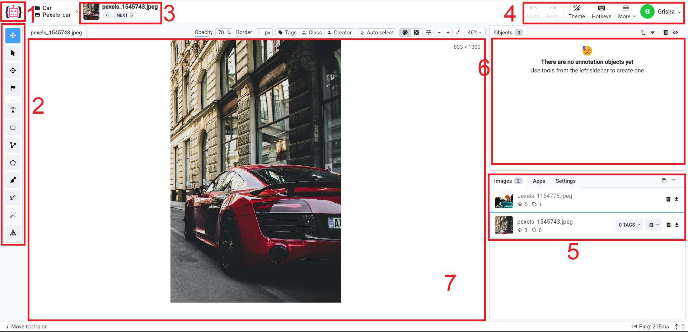

The image labeling toolbox allows you to annotate one image at a time, such as .jpg, .png, .tiff, and many more formats you can [import](../../data-organization/import/import/import.md) to Supervisely.

## Classic vs Version 2.0
We have two versions of the image labeling toolbox: the time proven classic version and it’s successor: the most advanced image labeling toolbox 2.0. By default, we suggest annotating the version 2.0 which has much more functionality and provides better performance and only consider the classic version in case you have a valid reason for that, such as your team got used to it and loves it so much 🙂

## Overview

1. Home button — returns user to the main menu (`Projects` page)
2. Instruments panel — tools used to create annotations
3. Navigation panel — current image and dataset
4. Additional controls — quick links and application view settings
5. Images panel — list of images in the dataset
6. Figures panel — list of figures on the current image
7. Main scene — current image and annotations

