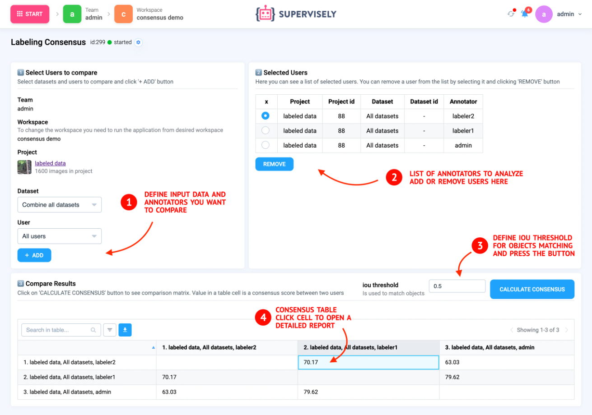

# Labeling Consensus

Consensus labeling is an annotation approach when multiple annotators collaboratively label the same set of images independently and the resulting annotation is based on combining labels with one of the consensus algorithms like, for example, the well-known majority voting. This approach is not limited to specific computer vision tasks and can be used for object detection, semantic and instance segmentation, classification and others.

Traditionally all annotators are compared with each other and the consensus scores are calculated for every possible pair of labelers. These consensus scores measure the agreement between labels and show how similar different annotations are. This metric can have any value between 0 % to 100 %. In case there are 2 completely different annotations the consensus for an image would be 0 %. If annotations are identical - the score would be 100 %. The higher values of the score show that annotations are more similar.


We have an [application](https://ecosystem.supervisely.com/apps/consensus?utm_source=blog) for easy use

You can see a detailed example in the blog
[(https://supervisely.com/blog/labeling-consensus)](https://supervisely.com/blog/labeling-consensus/)


## Step-By-Step Guide

 Video guide 
https://supervisely.com/blog/labeling-consensus