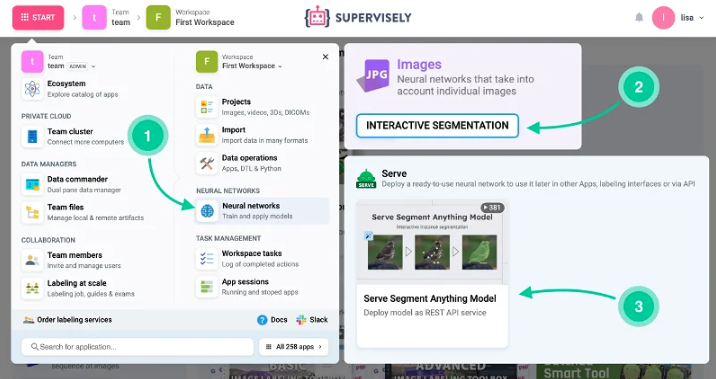

# Run pre-trained models

You can deploy your trained model in Supervisely with just a click or pick one of the ready-to-use pre-trained models from the Ecosystem. Search for “Serve …” Supervisely App and run the model on one of your agents. Now, use API to communicate with the model or use one of our Supervisely Apps that helps you apply the model in various scenarios, such as running the model on each image in the dataset or integrating it in the Labeling Toolbox.

## Some examples of pre-trained models:
- [Serve MMDetection](https://ecosystem.supervisely.com/apps/mmdetection/serve)
- [Serve MMClassification](https://ecosystem.supervisely.com/apps/mmclassification/supervisely/serve)
- [Serve Segment Anything in High Quality](https://ecosystem.supervisely.com/apps/serve-segment-anything-hq/supervisely_integration/serve)
- [Serve UNet](https://ecosystem.supervisely.com/apps/unet/supervisely/serve)

[and other](https://ecosystem.supervisely.com/neural-network+images)

## Some examples of model applications:

- [Apply NN to Images Project](https://ecosystem.supervisely.com/apps/nn-image-labeling/project-dataset)

- [NN Image Labeling](https://ecosystem.supervisely.com/apps/nn-image-labeling/annotation-tool)

- [Batched Smart Tool](https://ecosystem.supervisely.com/apps/dev-smart-tool-batched)

- [Apply OWL-ViT To Images Project](https://ecosystem.supervisely.com/apps/apply-owl-vit-to-images-project)

- [Apply Detection and Pose Estimation Models to Images Project](https://ecosystem.supervisely.com/apps/apply-det-and-pose-estim-models-to-project)

## Guides on running models in Supervisely:

### **Segment Anything Model**

- Step 1. Connect your computer with GPU using this [90 seconds video guide](https://youtu.be/aO7Zc4kTrVg). This is a one-time procedure, if you already connected your computer, just skip this step.

     Video guide 

- Step 2. Segment Anything (SAM) and Segment Anything in High Quality (HQ-SAM) models are integrated in the form of Supervisely Apps. Just press the "Run" button to start them on the GPU computer connected to your account.

    

- Step 3.Select the SmartTool in the image labeling toolbox, put the bounding box around the object of interest and correct predictions with 🟢 positive and 🔴 negative clicks.


You can see a detailed example in the [blog](https://supervisely.com/blog/segment-anything-in-high-quality-HQ-SAM/) 


